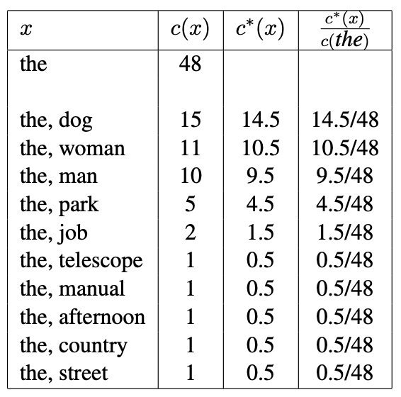

# 三元模型的平滑估计

极大似然估计会导致稀疏数据的问题，即使训练集非常大，很多 $c(u,v,w)$ 和 $c(u,v)$ 也会很小，甚至为 0。因此本节将讨论用于缓和数据稀疏问题的**平滑估计**（Smoothed Estimation），它的核心思想依赖于 lower-order statistical estimates，即用一元和二元模型的估计去平滑三元模型的估计。本节将讨论两种常用方法：**线性插值**（Linear Interpolation）和 **Discounting Methods**，以及与**装桶**（Bucketing）结合的线性插值。

## 线性插值

定义三元、二元和一元模型的极大似然估计为：

$$
q_{ML}(w|u,v)=\frac{c(u,v,w)}{c(u,v)}
$$

$$
q_{ML}(w|v)=\frac{c(u,v,w)}{c(v)}
$$

$$
q_{ML}(w)=\frac{c(u,v,w)}{c()}
$$

$c(w)$ 表示单词 $w$ 在训练集中出现的次数，$c(\cdot)$ 表示训练集中所有单词的数量。

它们有各自的优缺点：一元模型估计出的参数的分子和分母一定会大于 0（因为每个词在训练集中都至少出现了一次），但它完全忽视了上下文信息。而三元模型考虑了上下文信息，但很多参数会被估计为 0，数据更稀疏。二元模型则介于两者之间。

因此**线性插值**（Linear Interpolation）的思想是把三种估计加权平均，定义三元估计为：

$$
q(w|u,v)=\lambda_1 \times q_{ML}(w|u,v) + \lambda_2 \times q_{ML}(w|v) + \lambda_3 \times q_{ML}(w)
$$

其中 $\lambda_1 \geq 0, \lambda_2 \geq 0, \lambda_3 \geq 0$，且 $\lambda_1 + \lambda_2 + \lambda_3 = 1$。

&nbsp;

估计 $\lambda$ 的值有多种方式，一种常见的方法是：假设我们有一些不同于训练集和测试集的额外的数据，称之为**验证集**（development set/validation set）。$c'(u, v, w)$ 为三元组 $(u, v, w)$ 在验证集中出现的次数。则验证集上的 **log-likelihood**（对数似然函数值）为：

$$
L(\lambda_1,\lambda_2,\lambda_3)=\sum_{u,v,w}c'(u,v,w) \log q(w|u,v)
$$

$$
=\sum_{u,v,w}c'(u,v,w) \log (\lambda_1 \times q_{ML}(w|u,v) + \lambda_2 \times q_{ML}(w|v) + \lambda_3 \times q_{ML}(w))
$$

我们要选择使 $L(\lambda_1,\lambda_2,\lambda_3)$ 尽可能大，且满足 $\lambda_1 \geq 0, \lambda_2 \geq 0, \lambda_3 \geq 0$，$\lambda_1 + \lambda_2 + \lambda_3 = 1$ 的 $\lambda$ 值：

$$
\arg \max_{\lambda_1,\lambda_3,\lambda_3} L(\lambda_1,\lambda_2,\lambda_3)
$$

&nbsp;

综上，我们引入了三个平滑参数 $\lambda_1,\lambda_2,\lambda_3$，这三个参数可以被理解为是三元、二元、一元极大似然估计的置信度或权重。比如，如果 $\lambda_1$ 的值非常接近于 1 ，则意味着我们认为 $q_{ML}(w|u,v)$ 的意义很大；相反，如果 $\lambda_1$ 接近于 0，则意味我们认为 $q_{ML}(w|u,v)$ 的意义不大。

在实际操作中，我们应该让 $\lambda_1,\lambda_2,\lambda_3$ 根据不同的二元组 $(u, v)$ 进行改变。具体来说，当 $c(u, v)$ 更大时，我们应该将 $\lambda_1$ 变得更大。因为我们认为当 $c(u, v)$ 较大时，应该给三元估计更高的置信度。

需要保证当 $c(u, v) = 0$ 时，$\lambda_1 =0$。因为此时 $q_{ML}(w|u,v)=\frac{c(u,v,w)}{c(u,v)}$ 的分母为 0，三元极大似然估计的无法定义。同样，如果 $c(u, v)$ 和 $c(v)$ 都为 0，那么需要保证 $ \lambda_1 = \lambda_2 = 0$，因为此时三元和二元极大似然估计都无法定义。

&nbsp;

另一种更简单的定义 $\lambda$ 的方法是：

$$
\lambda_1 = \frac{c(u,v)}{c(u,v)+ \gamma}
$$

$$
\lambda_2 = (1-\lambda_1) \times \frac{c(v)}{c(v)+ \gamma}
$$

$$
\lambda_3 = 1 - \lambda_1 - \lambda_2
$$

$\gamma > 0$ 是该方法中唯一的参数。这种方法可以保证 $\lambda_1 \geq 0, \lambda_2 \geq 0, \lambda_3 \geq 0$ 和 $\lambda_1 + \lambda_2 + \lambda_3 = 1$。

$\lambda_1$ 会随着 $c(u, v)$ 的增大而增大，$\lambda_2$ 会随着 $c(v)$ 的增大而增大。如果 $c(u, v) = 0$，则有 $\lambda_1 = 0$；如果 $c(v) = 0$，则有 $\lambda_2 = 0$。$\gamma$ 依然取能最大化验证集上的 log-likelihood 的值。

这种决定参数的方式非常粗糙，而且一般情况下并不是最优的。但它足够简单，且有较好的实际应用效果。

## Discounting Methods

先考虑一下二元模型的估计，目标是对任意 $w \in \mathcal{V} \cup \{\text{STOP}\}$，$v \in \mathcal{V} \cup \{*\}$，估计出 $q(w|v)$。

对任意 $c(v,w)>0$，定义 discounted counts 为：

$$
c^*(v,w)=c(v,w)-\beta
$$

$\beta$ 的值在 0 到 1 之间（一般取 $\beta = 0.5$）。减去 $\beta$ 是因为如果完全使用训练集中的统计数据，会导致高估训练集中出现过的二元组的概率，低估训练集中未出现过的二元组的概率。

对任意满足 $c(u,v)>0$ 的二元组 $(u,v)$，定义：

$$
q(w|v)=\frac{c^*(v,w)}{c(v)}
$$

相当于在分子上减去了 discounted counts。

如：对以下数据，单词 $the$ 在训练集中出现了 48 次。下表列出了所有满足 $u=the,c(u,v)>0$ 的二元组 $(u,v)$（这些二元组的总数为 48）、所有 discounted counts：$c^*(x)=c(x)-\beta$（$\beta=0.5$）和所有 $\frac{c^*(x)}{c(the)}$。

对于所有 $v$，Discounting Methods 都造成了一些概率质量丢失（missing probability mass）：

$$
\alpha(v)=1- \sum_{w:c(v,w)>0} \frac{c^*(v,w)}{c(v)}
$$

如上例中：

$$
\alpha(the)=1- \sum_{w:c(the,w)>0} \frac{c^*(the,w)}{c(the)}
$$

$$
= 1 - (\frac{14.5}{48} + \frac{10.5}{48} + \frac{9.5}{48} + \frac{4.5}{48} + \frac{1.5}{48} + 5 \times  + \frac{0.5}{48}) = 1 - \frac{43}{48} = \frac{5}{48}
$$

这些丢失的质量应该是属于 $c(u,w)=0$ 的。

&nbsp;

因此，这种估计方法的完整定义如下，令：

$$
\mathcal{A}(v) = \{w:c(v,w)>0\}
$$

$$
\mathcal{B}(v) = \{w:c(v,w)=0\}
$$

如上例中，有：

$$
\mathcal{A}(v) = \{\text{dog, woman, man, park, job, telescope, manual, afternoon, country, street}\}
$$

而 $\mathcal{B}(v)$ 包括词典中剩下额单词。

则该估计的定义为：

$$
q_D(w|v)= 
\begin{cases}
   \frac{c^*(v,w)}{c(v)} & \text{if } w \in \mathcal{A}(v) \\
   \alpha(v) \times \frac{q_{ML}(w)}{\sum_{w \in \mathcal{B}(v)}q_{ML}(w)} & \text{if } w \in \mathcal{B}(v)
\end{cases}
$$

&nbsp;

这种方法可以推广到三元模型，对任意二元组 $(u,v)$，定义：

$$
\mathcal{A}(u,v) = \{w:c(u,v,w)>0\}
$$

$$
\mathcal{B}(u,v) = \{w:c(u,v,w)=0\}
$$

定义三元组 $(u,v,w)$ 的 discounted counts 为：

$$
c^*(u,v,w)=c(u,v,w)-\beta
$$

则三元估计为：

$$
q_D(w|u,v)= 
\begin{cases}   
	\frac{c^*(u,v,w)}{c(u,v)} & \text{if } w \in \mathcal{A}(u,v) \\   
	\alpha(u,v) \times \frac{q_{ML}(w|v)}{\sum_{w \in \mathcal{B}(u,v)}q_{ML}(w|v)} & \text{if } w \in \mathcal{B}(u,v)
\end{cases}
$$

其中：

$$
\alpha(u,v)=1- \sum_{w \in \mathcal{A}(u,v)} \frac{c^*(u,v,w)}{c(u,v)}
$$

&nbsp;

$\beta$ 是该方法中唯一的参数，跟线性插值模型一样，一般也是用能最大化 development data 上的 log-likelihood $\beta$。定义 $c'(u,v,w)$ 为三元组 $u,v,w$ 在 development data 中出现的次数，development data 上的 log-likelihood 为：
$
\sum_{u,v,w}c'(u,v,w) \log q_D (w|u,v)
$
$q_D (w|u,v)$ 会随着 $\beta$ 的变化而变化，一般我们会尝试一系列可能的 $\beta$ 值，如 $\{0.1,0.2,...,0.9\}$，对每个 $\beta$ 值都计算一遍 development data 上的 log-likelihood，最后选择能最大化 development data 上的 log-likelihood 的 $\beta$。

## 线性插值 + bucketing

线性插值模型中参数估计的定义为：

$$
q(w|u,v)=\lambda_1 \times q_{ML}(w|u,v) + \lambda_2 \times q_{ML}(w|v) + \lambda_3 \times q_{ML}(w)
$$

当 $c(u, v)$ 更大时，我们应该将 $\lambda_1$ 变得更大；同样，当 $c(v)$ 更大时，也应该将 $\lambda_2$ 变得更大。一个实现这个目标的典型方法是 bucketing。

第一步是定义一个函数 $\Pi$，它将二元组 $(u,v)$ 映射到值 $\Pi(u,v) \in \{1,2,...,K\}$，$K$ 是指定的 bucket 的数量。也就是说函数 $\Pi$ 将二元组 $(u, v)$ 划分为了 $K$ 个不同的子集。这个函数是手动定义的，它通常取决于不同二元组在训练集中的出现频率。

如：

$$
\begin{aligned}
   \Pi(u,v)=1 & \quad \text{if } 100 \leq c(u,v) \\
   \Pi(u,v)=2 & \quad \text{if } 50 \leq c(u,v) < 100 \\
   \Pi(u,v)=3 & \quad \text{if } 20 \leq c(u,v) < 50 \\
   \Pi(u,v)=4 & \quad \text{if } 10 \leq c(u,v) < 20 \\
   \Pi(u,v)=5 & \quad \text{if } 5 \leq c(u,v) < 10 \\
   \Pi(u,v)=6 & \quad \text{if } 2 \leq c(u,v) < 5 \\
   \Pi(u,v)=7 & \quad \text{if } c(u,v) = 1 \\
   \Pi(u,v)=8 & \quad \text{if } c(u,v) = 0 \text{ and } c(v) > 0 \\
   \Pi(u,v)=9 & \quad \text{otherwise}
\end{aligned}
$$

然后我们对所有 $k \in \{1,2,...,K\}$ 引入平滑参数 $\lambda_1^{(k)},\lambda_2^{(k)},\lambda_3^{(k)}$，因此每个 bucket 都会有一组自己的平滑参数。这些平滑参数同样需要满足 $\lambda_1^{(k)} \geq 0,\lambda_2^{(k)} \geq 0,\lambda_3^{(k)} \geq 0, \lambda_1^{(k)} + \lambda_2^{(k)} + \lambda_3^{(k)} = 1$。

则线性插值估计的定义为：

$$
q(w|u,v)=\lambda_1^{(k)} \times q_{ML}(w|u,v) + \lambda_2^{(k)} \times q_{ML}(w|v) + \lambda_3^{(k)} \times q_{ML}(w)
$$

其中 $k \in \Pi(u,v)$。

因此，平滑参数依赖于 $\Pi(u,v)$ 的值，而 $\Pi(u,v)$ 依赖于 $c(u,v)$ 和 $c(v)$。

&nbsp;

平滑参数还是取能最大化验证集上的 log-likelihood 的值。定义 $c'(u,v,w)$ 为三元组 $u,v,w$ 在验证集中出现的次数，则验证集上的的 log-likelihood 为：

$$
\sum_{u,v,w} c'(u,v,w) \log q(w|u,v)
$$

$$
= \sum_{u,v,w} c'(u,v,w) \log (\lambda_1^{(\Pi(u,v))} \times q_{ML}(w|u,v) + \lambda_2^{(\Pi(u,v))} \times q_{ML}(w|v) + \lambda_3^{(\Pi(u,v))} \times q_{ML}(w))
$$

$$
= \sum_{k=1}^K \sum_{u,v,w: \Pi(u,v)=k} c'(u,v,w) \log (\lambda_1^{(k)} \times q_{ML}(w|u,v) + \lambda_2^{(k)} \times q_{ML}(w|v) + \lambda_3^{(k)} \times q_{ML}(w))
$$

然后取能最大化这个值的 $\lambda_1^{(k)},\lambda_2^{(k)},\lambda_3^{(k)}$。