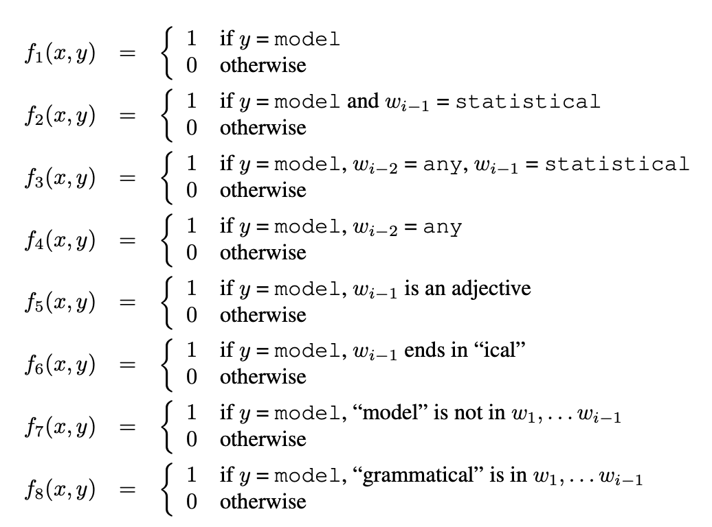

# 特征

 $$f(x,y) \in \Reals^d$$ 是表示 $$(x,y)$$ 的特征向量，向量中的 $$f_k(x,y)$$（$$k=1...d$$）被称为**特征（feature）**。每个特征都有一个与之相关的参数 $$v_k$$，$$v_k$$ 的值需要从训练集中估计出来。训练集由样本序列 $$(x^{(i)}, y^{(i)})$$ 组成，其中 $$i=1...n,x^{(i)} \in \mathcal{X}, y^{(i)} \in \mathcal{Y}$$。

## Features for Language Modeling 

语言模型中，输入 $$x$$ 是单词序列 $$w_1w_2...w_{i-1}$$，标签 $$y$$ 是一个单词 $$w_i$$。下图展示了一些特征的例子，每个特征都是一个返回 0 或 1 的指示函数（indicator functions）：

前三个特征 $$f_1,f_2,f_3$$ 与三元模型中的一元、二元、三元特征类似，特征 $$f_4...f_8$$ 则考虑了[其他的信息](/ai/nlp/log-linear-models/)。

## Feature Template

上例中，前三个特征指向的是特定的 unigram，bigram 或 trigram。而特征模板（feature template）可以用来生成考虑了训练集中所有 unigram，bigram 或 trigram 的特征集。

**定义 3.2（三元特征模板（Trigram feature template））：**

对训练集中出现过的任意三元组 $$(u,v,w)$$，定义特征：
$$
f_{N(u,v,w)}(x,y) = 
\begin{cases}
   1 &\text{if } y=w,w_{i-2}=u,w_{i-1}=v \\
   0 &\text{otherwise}
\end{cases}
$$
其中 $$N(u,v,w)$$ 是将训练集中的三元组映射到一个唯一整数的的函数。

值得注意的是：

- 该模板只能生成训练集中出现过的三元组的特征。因为所有可能的三元组有 $$|\mathcal{V}|^3$$ 个，这个数字非常庞大，所以对所有三元组生成特征是不可行的。而且对于训练集中未出现过的三元组，我们没有证据去估计它们的参数。（但考虑 $$(u,v)$$ 在训练集中出现过，而 $$(u,v,w)$$ 却未在训练集中出现过的三元组是有道理的，之后会讨论这个问题。）

- $$N(u,v,w)$$ 会将训练集中的三元组映射到一个唯一整数，即对任意满足 $$u \not= u' \text{ or } v \not= v' \text{ or } w \not= w'$$ 的三元组 $$(u,v,w)$$ 和 $$(u',v',w')$$，有：
  $$
  N(u,v,w) \not= N(u',v',w')
  $$
  在实现特征模板时，$$N$$ 会用哈希函数（hash function）来实现。如可以用一个哈希表把字符串 $$\text{trigram=any-statistical-model }$$ 映射到一个整数。每个不同的字符串都会被映射到一个不同的整数。

 

**定义 3.3（二元特征模板（Bigram feature template））：**

对训练集中出现过的任意二元组 $$(v,w)$$，定义特征：
$$
f_{N(v,w)}(x,y) = 
\begin{cases}   
1 &\text{if } y=w,w_{i-1}=v \\   
0 &\text{otherwise}
\end{cases}
$$
其中 $$N(v,w)$$ 是将训练集中的二元组映射到一个唯一整数的的函数。

 

**定义 3.4（一元特征模板（Unigram feature template））：**

对训练集中出现过的任意 unigram $$(w)$$，定义特征：
$$
f_{N(w)}(x,y) = 
\begin{cases}   
1 &\text{if } y=w \\   
0 &\text{otherwise}
\end{cases}
$$
其中 $$N(w)$$ 是将训练集中的 unigram 映射到一个唯一整数的的函数。

 

需要避免一元、二元、三元特征重合，否则就会出现两个不同的 n-gram 被映射到同一个特征的情况。

定义 $$T, B, U$$ 为训练集中出现过的三元组、二元组和一元组的集合。定义：
$$
N_t = {i: \exist(u,v,w) \in T \text{ such that } N(u,v,w) = i}
$$

$$
N_b = {i: \exist(v,w) \in B \text{ such that } N(v,w) = i}
$$

$$
N_u = {i: \exist(w) \in U \text{ such that } N(w) = i}
$$

即需要满足：
$$
N_t \cap N_b = N_t \cap N_u = N_b \cap N_u = \empty
$$
在对数线性模型中，可以在使用哈希表时，通过把类似于 $$\text{trigram=any-statistical-model}$$，$$\text{bigram=statistical-model}$$，$$\text{unigram=model}$$ 等的字符串分别映射到不同的整数来实现这个约束。

 

当然我们也可以定义其他的特征模板，如：

**定义 3.5 (Length-4 Suffix Template)：**

对训练集中出现过的任意 $$(v,w)$$，其中 $$v=suff4(w_{i-1})$$，$$w=y$$，定义特征：
$$
f_{N(suff4=v,w)}(x,y) = 
\begin{cases}   
1 &\text{if } y=w \text{ and } suff4(x)=v \\   
0 &\text{otherwise}
\end{cases}
$$
其中 $$N(suff4=v,w)$$ 是将训练集中的 $$(v,w)$$ 映射到一个唯一整数的的函数（映射值不能与其他特征模板重复）。

## Feature Sparsity

**特征的稀疏性**

从特征模板的定义可以看出，最终生成的特征数量 $$d$$ 可能会非常大，而通常只极少部分 $$k$$（$$k \in \{1...d\}$$）能满足 $$f_k(x,y)=1$$。这就导致特征可能会非常稀疏，只有极少部分特征为非零值。比如在一个只用了一元、二元、三元特征模板的语言模型中，特征数量等于训练集中出现过的所有 unigram，bigram 和 trigram 的数量，但对任意 $$(x,y)$$，最多只可能有三个特征是非零值。

因为特征的稀疏性，在实现对数线性模型时就不需要直接操作 $$d$$ 维特征向量 $$f(x,y)$$ 了，只需要用一个哈希表对每对 $$(x,y)$$ 记录其非零特征的索引就行：
$$
Z(x, y) = \{k: f_k(x, y) = 1\}
$$
这个哈希函数计算 $$Z(x,y)$$ 的时间复杂度为 $$O(|Z(x,y)|)$$，而 $$|Z(x,y)| \ll d$$（比如在一个只用了一元、二元、三元特征模板的语言模型中，$$|Z(x,y)|$$ 最大为 3），所以这个方法相比直接计算所有 $$d$$ 个特征（时间复杂度 $$O(d)$$）会高效很多。

比如在计算向量内积 $$v \cdot f(x,y) = \sum_{k=1}^dv_kf_k(x,y)$$ 时，理论上需要 $$O(d)$$ 的复杂度，但因为 $$\sum_{k=1}^dv_kf_k(x,y) = \sum_{k \in Z(x,y)}v_k$$，所以只需要考虑非零特征，所以只需要 $$O(|Z(x,y)|)$$ 的复杂度。