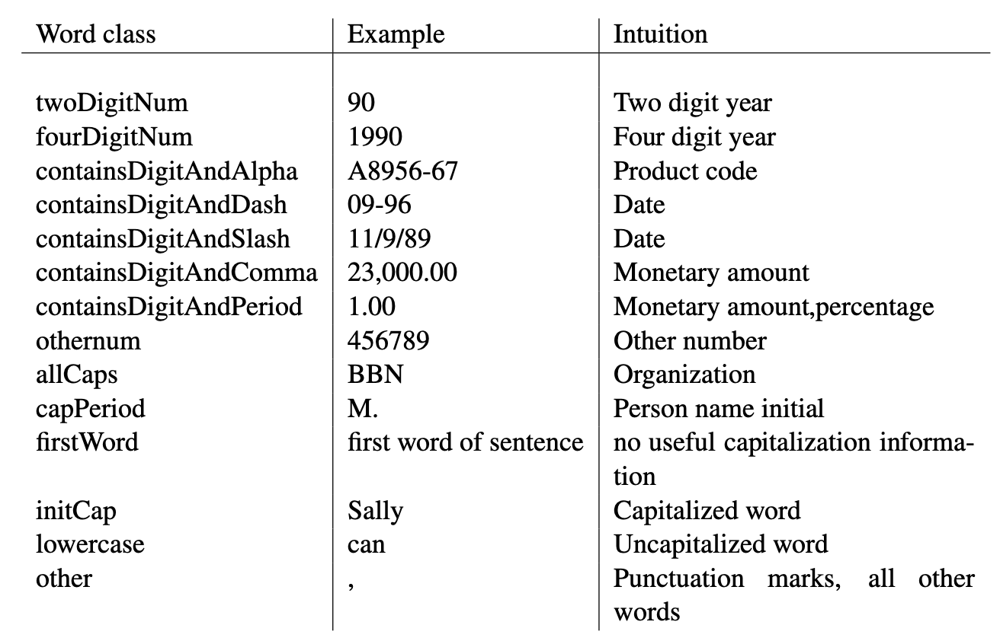
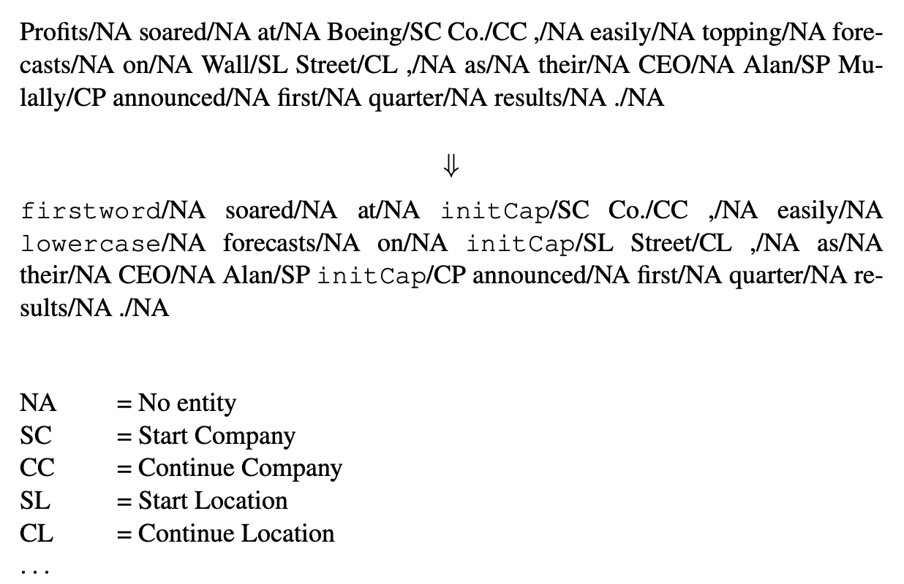

# 特殊处理

HMM 输出概率的参数估计为：
$$
e(x|s)=\frac{ c(s \rightsquigarrow x) }{c(s)}
$$
其中 $$c(s)$$ 为标签 $$s$$ 在训练集中出现的次数，$$c(s \rightsquigarrow x)$$ 为训练集中在 $$s$$ 状态下观察结果为 $$x$$ 的概率。

一个问题是，如果单词 $$x$$ 没有在训练集中出现过，对任意状态 $$s$$ 的 $$e(x|s)$$ 都会为 0。因此对任意包含未出现在训练集中的单词的测试句子 $$x_1...x_n$$，有：
$$
p(x_1 ... x_n, y_1 ... y_{n+1})=0
$$

$$
\arg \max_{y_1...y_{n+1}} p(x_1...x_n,y_1...y_{n+1}) = 0
$$

所以该模型对这样的测试数据是无效的。

&nbsp;

不管训练集有多大，肯定都不可避免的会出现训练集中没出现过的测试单词，所以本节将讨论一个解决这个问题的方法。该方法的核心思想是把训练集中出现频率低的单词和测试集中出现过但训练集中没出现过的单词，映射到一个伪词（pseudo-words）集合。如，把 *Mulally* 映射到伪词 *initCap*（首字母大写的单词），把 *1990* 映射到伪词 *fourDigitNum*（四位数）。伪词集是手工选择的，尽可能保留了不同单词的拼写特征。下图是一个例子（取自 [ref [2.4]](/ai/nlp/tagging-problems-hmms/)）：

定义 $$f(x)$$ 为从单词 $$x$$ 到其伪词的映射函数；$$\gamma$$（一般取 5）为一个界限，在训练集中出现次数低于$$\gamma$$ 的值会被映射到其伪词。测试集中出现过但训练集中没出现过的单词也会被映射到其伪词。这样测试集中的所有单词就都在训练集中出现过了（假设每个伪词都在训练集中出现过，这是比较好保证的），$$e(x|s)$$ 就不会为 0 了。完成映射后，就可以像之前一样进行参数估计和维比特算法，把其中一些词用伪词替代即可。下图是该映射的一个例子：

 

但使用这种方法时需要花费较多精力去定义映射，且不同任务中的映射一般都是不一样的。后面我们将讨论更好的解决在训练集中出现频率低或不出现的单词的问题的方法（基于对数线性模型（Log-Linear Models））。