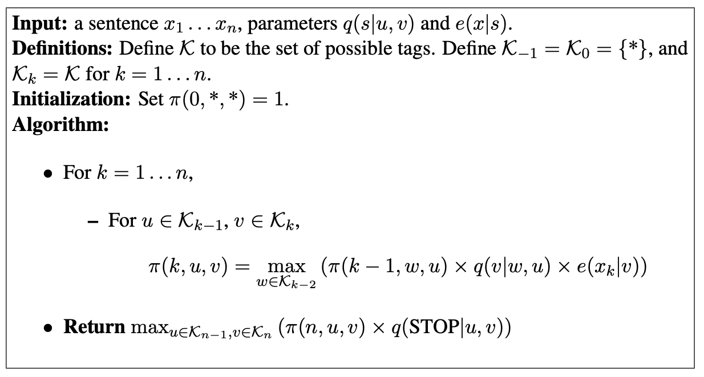
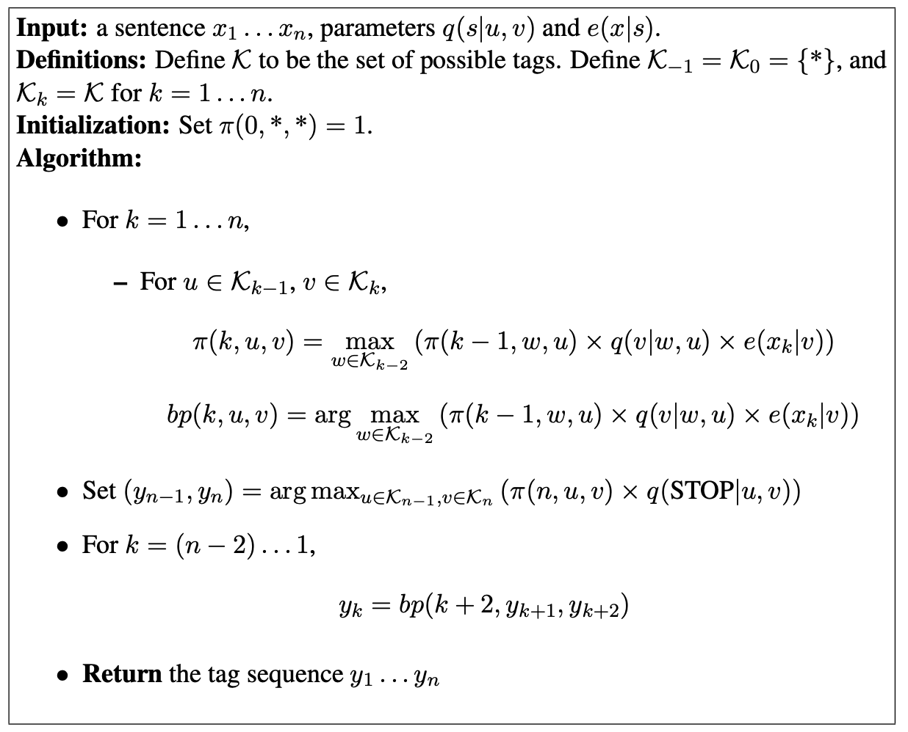

# 三元隐马尔科夫模型（Trigram Hidden Markov Models，Trigram HMMs）

## Definitions

**定义 2.2（Trigram HMMs）**：

trigram HMM 由有限集 $$\mathcal{V}$$、有限集 $$\mathcal{K}$$ 和以下参数组成：

- $$q(s|u,v)$$

  $$s \in \mathcal{K} \cup \{\text{STOP}\}$$，$$u, v \in \mathcal{K} \cup \{*\}$$。$$q(s|u,v)$$ 可以理解为标签 $$s$$ 跟在 $$(u,v)$$ 后的概率。

- $$e(x|s)$$

  $$x \in \mathcal{K}$$，$$s \in \mathcal{K}$$。$$e(x|s)$$ 可以理解为在 $$s$$ 状态下观察结果为 $$x$$ 的概率。

定义 $$\mathcal{S}$$ 为所有序列对 $$\langle x_1 ... x_n, y_1 ... y_{n+1} \rangle$$ 的集合（$$n \geq 0, x_i \in \mathcal{V}, y_i \in \mathcal{K}, i = 1...n, y_{n+1}=\text{STOP}$$）。

然后定义：
$$
p(x_1 ... x_n, y_1 ... y_{n+1})=\prod_{i=1}^{n+1}q(y_i|y_{i-2},y_{i-1})\prod_{i=1}^n e(x_i|y_i) \tag{2.3}
$$
其中 $$y_0 = y_{-1} = *$$，$$*$$ 是一个特殊的开始符号。

如：$$n = 3$$，$$x_1 ... x_3$$ 为一个句子 $$\text{the dog laughs}$$，$$y_1...y_4$$ 为标签序列 $$\text{D N V STOP}$$。则：
$$
p(x_1 ... x_n, y_1 ... y_{n+1})
$$

$$
=q(\text{D}|*,*) \times q(\text{N}|*,\text{D}) \times q(\text{V}|\text{D,N}) \times q(\text{STOP}|\text{N,V}) \times e(\text{the}|\text{D}) \times e(\text{dog}|\text{N}) \times e(\text{laughs}|\text{V})
$$

从模型的形式来看，这是一个噪声通道模型：

- $$q(\text{D}|*,*) \times q(\text{N}|*,\text{D}) \times q(\text{V}|\text{D,N}) \times q(\text{STOP}|\text{N,V})$$ 是标签序列 $$\text{D N V STOP}$$ 的先验概率（而且这里用了二阶马尔科夫模型）
- $$e(\text{the}|\text{D}) \times e(\text{dog}|\text{N}) \times e(\text{laughs}|\text{V})$$ 是条件概率 $$p(\text{the dog laugh}|\text{D N V STOP})$$

## Independence Assumptions

**Trigram HMMs 中的独立性假设**

考虑一对有随机变量组成的序列 $$X_1 ... X_n$$ 和 $$Y_1 ... Y_n$$，其中 $$X_i$$ 可以为 $$\mathcal{V}$$ 中的任何单词， $$Y_i$$ 可以为 $$\mathcal{K}$$ 中的任何标签。因为 $$n$$ 是一个随机变量，句子可以为任意长度，所以这里用与[变长序列的马尔科夫模型](../Language-Modeling/Markov-Models.md)中所用方法类似的方法来处理这个问题。

HMM 的任务是对联合概率进行建模（$$x_i \in \mathcal{V}, y_i \in \mathcal{K}$$）：
$$
P(X_1 = x_1 ... X_n = x_n, Y_1 = y_1 ... Y_{n+1} = y_{n+1})
$$

$$
= \prod_{i=1}^{n+1} P(Y_i = y_i | Y_{i-2} = y_{i-2}, Y_{i-1} = y_{i-1}) \prod_{i=1}^n P(X_i = x_i|Y_i = y_i) \tag{2.4}
$$

如果我们假设对任意 $$i$$、任意 $$y_{i-2},y_{i-1},y_i$$：
$$
P(Y_i = y_i | Y_{i-2} = y_{i-2}, Y_{i-1} = y_{i-1}) = q(y_i|y_{i-2},y_{i-1})
$$
且对任意 $$i$$、任意 $$x_i,y_i$$：
$$
P(X_i = x_i|Y_i = y_i) = e(x_i|y_i)
$$

那么公式 2.4 就可以写成上一部分中公式 2.3 的形式了。

------

公式 2.4 是由模型中的独立性假设推导出来的，首先：
$$
P(X_1 = x_1 ... X_n = x_n, Y_1 = y_1 ... Y_{n+1} = y_{n+1})
$$

$$
= P(Y_1 = y_1 ... Y_{n+1} = y_{n+1}) \times P(X_1 = x_1 ... X_n = x_n | Y_1 = y_1 ... Y_{n+1} = y_{n+1})
$$

这一步由链式法则直接推出。现在联合概率已经被分解为了标签序列 $$y_1 ... y_{n+1}$$ 的概率和在选定了标签序列的情况下 $$x_1 . . . x_{n+1}$$ 的概率，跟噪声通道模型的形式一样。

然后进行独立性假设：

1. 假设对任意序列 $$y_1 ... y_{n+1}$$：

   $$
    P(Y_1 = y_1 ... Y_{n+1} = y_{n+1}) = \prod_{i=1}^{n+1} P(Y_i=y_i|Y_{i-2}=y_{i-2},Y_{i-1}=y_{i-1})
   $$

   即假设 $$y_1 ... y_{n+1}$$ 是一个二阶马尔科夫序列，每个状态只依赖于它的前两个状态。

2. 假设对任意在给定标签序列 $$y_1 ... y_{n+1}$$ 的情况下的序列 $$x_1 ... x_{n+1}$$：
   $$
   P(X_1 = x_1 ... X_n = x_n | Y_1 = y_1 ... Y_{n+1} = y_{n+1})
   $$

   $$
   = \prod_{i=1}^n P(X_i = x_i |X_1 = x_1 ... X_{i-1} = x_{i-1}, Y_1 = y_1 ... Y_{n+1} = y_{n+1}) \tag{2.5}
   $$

   $$
   = \prod_{i=1}^n P(X_i = x_i | Y_i = y_i) \tag{2.6}
   $$

   公式 2.4 是链式法则，公式 2.6 是我们的假设。即我们假设 $$X_i$$ 只依赖于 $$Y_i$$，条件独立于其他所有变量。

然后就可以推出公式 2.4 了。

------

模型生成序列对 $$y_1 ... y_{n+1}, x_1 ... x_n$$ 的过程为：

1. 初始化  $$i = 1$$，$$y_0 = y_{-1} = *$$

2. 按分布 $$q(y_i |y_{i-2}, y_{i-1})$$ 生成 $$y_i$$
3. 如果 $$y_i = \text{STOP}$$，则返回 $$y_1 ... y_i, x_1 ... x_{i-1}$$；否则按分布 $$e(x_i |y_i)$$ 生成 $$x_i$$，然后 $$i = i + 1$$，返回步骤 2

## Parameters Estimation

**Trigram HMM 的参数估计**

有一个训练集，包含  $$x_1...x_n$$ 和其对应的  $$y_1...y_n$$。定义 $$c(u,v,s)$$ 为标签序列 $$(u,v,s)$$ 在训练集中出现的次数，$$c(u,v)$$ 为 $$(u,v)$$ 在训练集中出现的次数。定义 $$c(s \rightsquigarrow x)$$ 为训练集中在 $$s$$ 状态下观察结果为 $$x$$ 的概率，如 $$c(\text{N} \rightsquigarrow \text{dog})$$ 为标注为 $$\text{N}$$ 的 $$\text{dog}$$ 出现的概率。

则极大似然估计为：
$$
q(s|u,v)=\frac{c(u,v,s)}{c(u,v)}
$$

$$
e(x|s)=\frac{ c(s \rightsquigarrow x) }{c(s)}
$$

该模型的参数估计就是极大似然估计。现在[平滑](/ai/nlp/language-modeling/smoothed-estimation-of-trigram-models/)一下参数 $$q(s|u,v)$$：
$$
q(s|u,v)=\lambda_1 \times q_{ML}(s|u,v) + \lambda_2 \times q_{ML}(s|v) + \lambda_3 \times q_{ML}(s)
$$
其中 $$\lambda_1 \geq 0, \lambda_2 \geq 0, \lambda_3 \geq 0$$，且 $$\lambda_1 + \lambda_2 + \lambda_3 = 1$$。

 

该方法的一个问题是，如果单词 $$x$$ 在训练集中出现的频率很低甚至不出现，$$e(x|s)$$ 的值就会很不可靠甚至为 0。[后面](/ai/nlp/tagging-problems-hmms/advanced-material/)将讨论解决这个问题的方法。

## Viterbi Algorithm

**维比特算法**

现在回到找出 $$\arg \max_{y_1...y_{n+1}} p(x_1...x_n,y_1...y_{n+1})$$，即输入序列 $$x_1...x_n$$，找出概率最大的标签序列的问题。按照之前的定义：
$$
p(x_1 ... x_n, y_1 ... y_{n+1})=\prod_{i=1}^{n+1}q(y_i|y_{i-2},y_{i-1})\prod_{i=1}^n e(x_i|y_i)
$$
可以想到最暴力的方法是列举出所有可能的标签序列 $$y_1...y_{n+1}$$，用函数 $$p$$ 对他们进行打分，然后选出分最高的序列即可。对于长度为 $$n$$ 的输入句子，有 $$|\mathcal{K}|^n$$ 个可能的标签序列，所以时间复杂度太高，我们需要一种更高效的方法。

### The Basic Algorithm

#### Definitions

维比特算法是一种动态规划算法。给定输入序列 $$x_1...x_n$$，对任意 $$k \in \{1...n\}$$，任意序列 $$y_{-1}, y_0, y_1, ..., y_k$$（$$y_i \in \mathcal{K}, i = 1...k, y_0 = y_{-1} = *$$），令：
$$
r(y_{-1}, y_0, y_1, ..., y_k)=\prod_{i=1}^k q(y_i|y_{i-2},y_{i-1})\prod_{i=1}^k e(x_i|y_i)
$$
也就是只考虑前 $$k$$ 个元素：
$$
\begin{aligned}
p(x_1 ... x_n, y_1 ... y_{n+1}) &= r(*,*,y_1,...y_n) \times q(y_{n+1}|y_{n-1},y_n) \\
&=r(*,*,y_1,...y_n) \times q(\text{STOP}|y_{n-1},y_n)
\end{aligned} \tag{2.7}
$$
为了方便，用 $$\mathcal{K}_k$$（$$k \in \{-1, ..., n\}$$）来表示第 $$k$$ 个元素的所有可能标签：
$$
\mathcal{K}_{-1} = \mathcal{K}_0 = \{*\}
$$

$$
\mathcal{K}_k = \mathcal{K} \text{ for } k \in \{1...n\}
$$

然后对任意 $$k \in \{1...n\}$$，$$u \in \mathcal{K}_{k-1}, v \in \mathcal{K}_k$$，令 $$\mathcal{S}(k,u,v)$$ 为所有序列 $$y_{-1}, y_0, y_1, ..., y_k$$（$$y_i \in \mathcal{K}_i, i \in \{-1...k\}$$）的集合，其中 $$y_{k-1} = u, y_k = v$$。也就是说 $$\mathcal{S}(k,u,v)$$ 是所有长度为 $$k$$ 且以二元组 $$(u,v)$$ 结尾的标签序列的集合。

令 $$\pi(k,u,v)$$ 为长度为 $$k$$ 且以二元组 $$(u,v)$$ 结尾的标签序列的最大概率：
$$
\pi(k,u,v) = \max_{⟨y_0, y_1, ..., y_k⟩ \in \mathcal{S}(k,u,v)} r(y_{-1}, y_0, y_1, ..., y_k)
$$

#### Dynamic Programming

然后用动态规划的方法对所有 $$(k,u,v)$$ 求出 $$\pi(k,u,v)$$：

先令 $$\pi(0,*,*) = 1$$。

**命题 1：**

对任意 $$k \in \{1...n\}, u \in \mathcal{K}_{k-1}, v \in \mathcal{K}_k$$：
$$
\pi(k,u,v) = \max_{w \in \mathcal{K}_{k-2}} (\pi(k-1,w,u) \times q(v|w,u) \times e(x_k, v)) \tag{2.8}
$$
公式 2.7 的正确性显而易见。这里是在枚举所有的 $$w$$ 值，然后返回最大的 $$\pi(k,u,v)$$。

**命题 2：**
$$
\max_{y_1...y_{n+1}} p(x_1...x_n,y_1...y_{n+1}) = \max_{u \in \mathcal{K_{n-1}},v \in \mathcal{K}_n} (\pi(n,u,v) \times q(\text{STOP}|u,v)) \tag{2.9}
$$
公式 2.9 可由公式 2.7 推出。

 

下图展示了该算法的流程，输入为 $$x_1...x_n$$，输出为 $$\max_{y_1...y_{n+1}} p(x_1...x_n,y_1...y_{n+1})$$：

该算法时间复杂度是 $$O(n|\mathcal{K}|^3)$$。

### Backpointers

上面的算法返回了 $$\max_{y_1...y_{n+1}} p(x_1...x_n,y_1...y_{n+1})$$（最大概率），然而我们希望算法能返回 $$\arg \max_{y_1...y_{n+1}} p(x_1...x_n,y_1...y_{n+1})$$（概率最大的标签序列）。

所以要每一步都要存一个反向指针 $$bp(k,u,v)$$，记录下引出了当前这个概率最高的长度为 $$k$$ 且以 $$(u,v)$$ 结尾的序列的前一个状态 $$w$$，如下图所示：

## Strength and Weakness

- 容易训练，只需要在训练集中统计出现次数
- 效果比较好（在命名实体识别任务上准确率高于 90%）
- 当单词很复杂时，对 $$e(\text{word}|\text{tag})$$ 建模会很困难